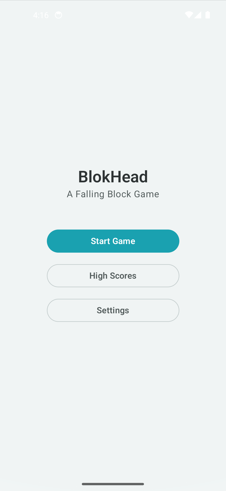
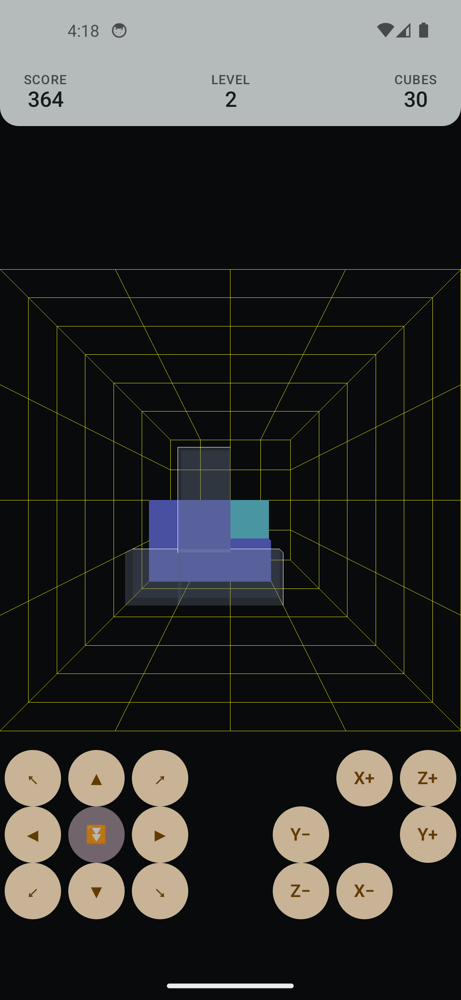
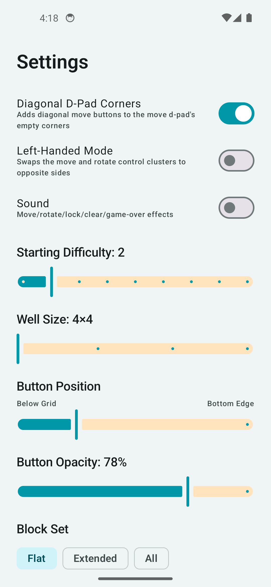
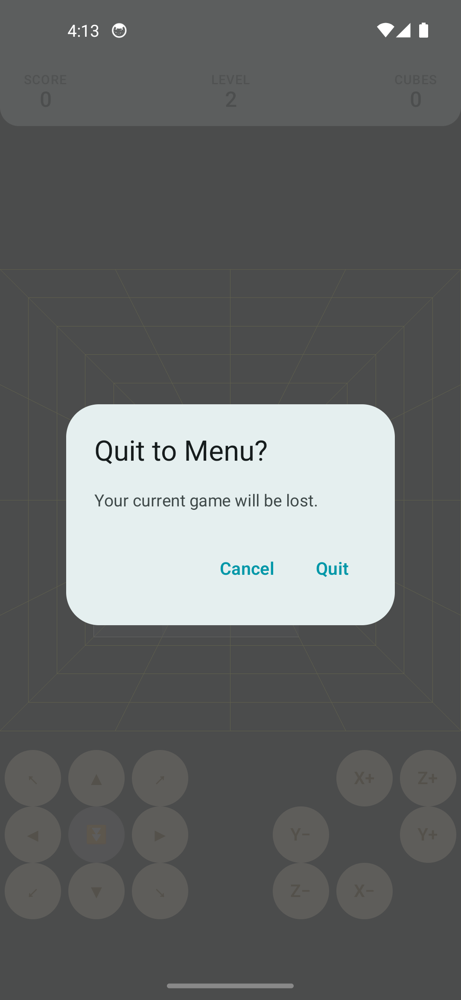

# BlokHead

BlokHead is a native Android port of [Blokout](https://jlehtinen.net/blokout/), a 3D falling-block
puzzle game from the late '90s. Pieces made of cubes fall through a square well and you move and
rotate them on all three axes — not just left/right and spin — to complete and clear full
horizontal layers before the stack reaches the top. Imagine Tetris, but the well has depth as well
as width, and so do the pieces.

This is a direct port: the well/piece/collision/scoring logic is translated line-for-line from the
original C source into pure Kotlin, and only the rendering (fixed-function GL1 → shader-based
GLES2) and the input layer (keyboard → touch) are genuinely new. Because of that lineage it carries
the same license as upstream rather than a fresh one — see [License](#license) below.

   

## Features

- **True 3D falling-block play**, ported faithfully from the original: pieces move and rotate on
  all three axes (X, Y, and Z) inside a square well, not just the two a flat Tetris clone needs.
- **Three selectable piece sets** — Flat (2D-only shapes, the gentlest entry point), Extended, and
  the full original set — chosen once in Settings rather than forced on every player.
- **A two-handed touch control layout** designed around where thumbs actually rest, not adapted
  from a keyboard as an afterthought: a move d-pad (with hard-drop folded into its center cell) on
  one side and a mirrored rotate cluster on the other, raised to sit just below the visible well
  rather than pinned to the screen's bottom edge. Swipe and long-press were deliberately ruled out
  as control schemes — they don't hold up at higher speeds.
- **A classic Tetris-style clear flash**: a completed layer briefly flashes before it disappears,
  instead of vanishing instantly — quick enough (a tenth of a second) that it doesn't interrupt
  the pace of play.
- **Pause with a safe way out** — tap above the well to pause (dims the grid, freezes the piece in
  place), and a small Menu button on the pause screen backed by a confirmation dialog, so a game
  in progress can't be abandoned by an accidental tap.
- **Synthesized sound effects** (move, rotate, lock, layer-clear, game-over) — generated tones, not
  licensed samples, toggleable in Settings.
- **A persisted local high-score table**, with a name-entry prompt when a run's score qualifies.
- **Deep settings coverage**: diagonal d-pad corners, left-handed mode (mirrors both control
  clusters to the opposite side), starting difficulty, well size, button vertical position, button
  opacity, sound on/off, and block set — all saved via DataStore and applied to the next game.

## Requirements

- Android Studio (recent stable) or a JDK-configured Gradle.
- minSdk 27 / targetSdk 37.
- No NDK, no native code, no network access — the whole game runs as plain Kotlin + OpenGL ES 2.0
  via `GLSurfaceView`.

## Building & testing

```
./gradlew assembleDebug        # build the debug APK
./gradlew testDebugUnitTest    # run the unit tests
```

The game-logic port (`game/`) is pure Kotlin with no Android dependency, so its unit tests run on
the JVM without an emulator — that's where the well/collision/scoring behavior is verified against
the original's logic as it's translated over.

This project targets a GitHub release only; there's no Play Store listing.

## Architecture

- `game/` — the direct port: well/grid state, piece forms, rotation, collision, scoring, and the
  `GameEngine` state machine, all rendering-free and independently unit-tested against the
  original's logic (`Tube`, `Block`, `Collision`, `Form`, `GameEngine`).
- `render/` — the `GLSurfaceView`-based OpenGL ES 2.0 renderer (`BlokoutRenderer`,
  `BlokoutSurfaceView`), including the perspective/grid-spacing math (`Geometry`) that keeps the
  well's wall lines evenly spaced from front to back regardless of well depth.
- `ui/` — Jetpack Compose screens and overlays layered over the GL surface: the main menu, in-game
  HUD, pause/game-over/high-score overlays, the touch controls (`GameControls`), and `Settings`.
- `audio/` — `SfxPlayer`, a `SoundPool` wrapper for the synthesized sound effects.
- `data/` — DataStore-backed persistence for settings (`SettingsStore`) and the high-score table
  (`HighScoreStore`).

## Attribution

- Game design and original implementation: Copyright (C) 1998-1999 Johannes Lehtinen and Petri
  Salmi, from [jlehtine/blokout](https://github.com/jlehtine/blokout).
- Ported to Kotlin/Android, with a rebuilt touch UI and OpenGL ES 2.0 renderer, by rm.
  
## License

GNU General Public License v3 (or later) — see [LICENSE](LICENSE), matching the upstream project.
